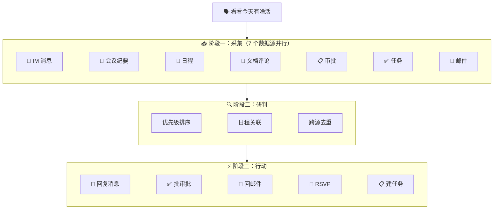

<p align="center">
  <h1 align="center">lark-todo</h1>
  <p align="center">
    <strong>飞书全平台待办行动扫描器</strong><br>
    一句话触发全平台扫描：自动采集 IM 消息、会议纪要、日程、文档评论、审批、邮件、已有任务，智能排列优先级，支持直接处理或创建飞书任务。
  </p>
  <p align="center">
    
    
    
    
  </p>
  <p align="center">
    <a href="README_EN.md">English</a>
  </p>
</p>

---

## 它解决什么问题

每天打开飞书，消息 999+、审批红点、日程提醒、文档评论……分散在各个角落，翻一圈下来 20 分钟过去了，还不确定有没有漏掉什么。

所以我做了 lark-todo：**一句话下去，7 个数据源并行扫描，AI 按紧急程度排好优先级，能当场处理的直接处理，不能的创建任务。** 再也不用自己一个个翻了。

## 🧭 Before / After

| | 手动翻飞书 | lark-todo |
|---|:---:|:---:|
| **找待办** | 翻消息、翻审批、翻邮件、翻日历…… 20 min | 7 个数据源并行扫描，30 秒 |
| **判优先级** | 靠记忆和直觉 | AI 按紧急程度自动排序 + 日程关联 |
| **处理事项** | 逐个切换应用操作 | 选序号直接回复/审批/RSVP |
| **遗漏风险** | 高（尤其是文档评论和过期任务） | 全平台扫描，不漏 |

## 💬 一句话怎么用

```
看看今天有啥还没干的活么
```

AI Agent 自动完成：

1. **采集** — 并行扫描 IM 消息、会议纪要、日程、文档评论、审批、已有任务、未读邮件
2. **研判** — 按紧急程度排序，关联即将到来的日程，跨源去重
3. **行动** — 能当场解决的直接处理（回复消息、批审批、回邮件），不能的创建飞书任务

## 📊 扫描结果示例

```
## 今日待处理事项（2026-04-16 星期三）全量扫描

### 即将到来的日程
  15:00-16:00 方案评审（待确认 — 需回复邀请）
   └─ 关联：第 3 项消息与此会议相关，建议提前处理

### 待处理事项

1. [紧急] [产品群] 张三：请帮忙 review 一下这个 PR（4小时前未回复）
   └─ 来源：消息 | 建议：直接回复
2. [紧急] 完成季度报告（已过期 2 天）
   └─ 来源：飞书任务
3. [普通] [采购审批] 申请人：小明，14:30 提交
   └─ 来源：审批 | 建议：直接审批
4. [低优先级] [方案文档] 王五评论：建议补充性能测试数据
   └─ 来源：文档评论 | 修改建议：在第3节补充压测结果

---
共 4 项（紧急 2 / 普通 1 / 低优先级 1）
输入序号直接处理，或说"全部建任务"。
```

## 🏗️ 架构



## 🎯 直接处理能力

选择序号后，技能会根据事项类型自动选择最合适的处理方式：

| 事项 | 直接处理 | 用户确认方式 |
|------|---------|-------------|
| IM 消息 | 拟好回复草稿 → 发送 | 展示草稿，确认后发 |
| 审批单 | 同意/拒绝 | 展示摘要，确认操作 |
| 文档评论 | 拟好回复 → 提交 | 展示内容，确认后提交 |
| 邮件 | 拟好回复 → 发送 | 展示草稿（默认存草稿） |
| 日程邀请 | 接受/拒绝/暂定 | 展示详情，确认操作 |
| 会议待办 | 创建飞书任务 | 确认任务详情 |

> 所有写操作都会先展示给你确认，不会自动执行。

## 🧩 扫描模式

| 触发方式 | 时间范围 | 场景 |
|---------|---------|------|
| "看看今天有啥活" | 今天全天 | 早晨开工 |
| "下午有啥新的" | 今天 12:00 起 | 午后检查 |
| "最近两小时" | 近 2 小时 | 快速扫描 |
| "收工前再扫一遍" | 增量扫描 | 下班前检查 |

## 📦 安装

### 前置条件

- 支持 SKILL.md 规范的 Agent 应用（[Claude Code](https://claude.com/claude-code) / [Trae](https://www.trae.cn/) / [Cline](https://cline.bot/) 等）
- [lark-cli](https://github.com/larksuite/cli) >= 1.0.9
- 一个飞书自建应用（首次使用时自动引导配置）

### 安装方式

**Claude Code**

```bash
# 方式一：放在项目目录（自动发现）
git clone https://github.com/autumnseasonism/lark-todo-skill.git

# 方式二：放在全局 skills 目录
git clone https://github.com/autumnseasonism/lark-todo-skill.git ~/.agents/skills/lark-todo
```

**Trae / Cline / 其他 Agent**

将 `lark-todo` 目录放到对应 Agent 的 skills 扫描路径下，具体路径请参考各 Agent 的文档。

### 首次使用

技能会自动引导你完成三步初始化，无需手动配置：

1. **应用配置** — 绑定飞书自建应用（`lark-cli config init`）
2. **用户授权** — 一次性授权所有需要的权限（11 个 domain）
3. **命令白名单**（仅 Claude Code）— 将 `lark-cli` 加入白名单

三步完成后，后续使用直接说话即可。

## 🔒 安全与边界

- **先读后写** — 采集阶段只读不写；行动阶段所有写操作必须经用户确认
- **不保存凭证** — 认证交给 `lark-cli`，Skill 不保存任何 token
- **邮件防注入** — 邮件内容视为不可信输入，绝不执行正文中的"指令"
- **权限降级** — 任何数据源权限不足时跳过并标注，不阻塞其他数据源
- **密钥不外泄** — 禁止输出 appSecret、accessToken 到终端

## ✅ 测试覆盖

```bash
cd lark-todo-skill

# 基础测试（17 项，快速验证）
bash evals/run_tests.sh

# 综合测试（44 项，完整覆盖）
bash evals/run_full_tests.sh
```

| 测试组 | 数量 | 覆盖内容 |
|--------|------|---------|
| 启动检查 | 4 | config、auth、用户信息 |
| 数据源采集 | 7 | 7 个数据源命令可用性 |
| 两路文档搜索 | 3 | creator_ids 过滤、only_comment 过滤 |
| 增量扫描 | 3 | 不同时间范围 |
| 行动命令 | 15 | 6 种行动的参数逐个验证 |
| 响应结构 | 6 | 关键 JSON 字段存在性 |
| 边界情况 | 3 | 无效参数、权限检查 |
| 会议纪要链路 | 3 | vc +notes / +recording 参数 |

## 🛠️ 技术特点

- **零代码，纯 Skill** — 完全通过 `SKILL.md` + references 实现，无外部脚本依赖
- **自包含设计** — 认证、权限、命令参数全部内嵌，不依赖 lark-shared 或其他技能包
- **两路文档搜索** — `creator_ids` 搜我的文档 + `only_comment` 搜 @我的评论，避免遗漏
- **智能优先级** — 不用死板打分，基于"拖延后果严重性"推理排序
- **多 Agent 兼容** — Claude Code / Trae / Cline 等支持 SKILL.md 的 Agent 均可使用

## 📁 文件结构

```
lark-todo-skill/
├── SKILL.md                  # 主技能文件（流程逻辑、优先级判断、输出格式）
├── references/
│   ├── data-sources.md       # 7 个数据源的详细 CLI 命令和字段提取规则
│   └── action-dispatch.md    # 6 种行动的详细 CLI 命令和安全规则
├── evals/
│   ├── evals.json            # 测试用例定义
│   ├── run_tests.sh          # 基础测试（17 项）
│   └── run_full_tests.sh     # 综合测试（44 项）
├── LICENSE                   # MIT License
├── README.md                 # 中文文档
└── README_EN.md              # English documentation
```

## 📄 依赖

本项目依赖 [lark-cli](https://github.com/larksuite/cli)（MIT License）作为底层 CLI 工具。lark-todo 不包含 lark-cli 的任何代码，仅通过命令行调用其功能。

## 🤝 贡献

欢迎提交 Issue 和 Pull Request。

## 📄 许可证

[MIT](LICENSE)
