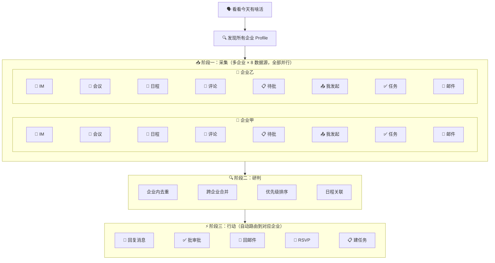

<p align="center">
  <h1 align="center">lark-todo</h1>
  <p align="center">
    <strong>飞书全平台待办行动扫描器 · 支持多企业账号</strong><br>
    一句话触发全平台扫描：自动采集 IM 消息、会议纪要、日程、文档评论、待办审批、我发起的审批、邮件、已有任务，智能排列优先级，支持直接处理或创建飞书任务。多个企业账号并行扫描，跨企业合并排序。
  </p>
  <p align="center">
    
    
    
    
    
    
  </p>
  <p align="center">
    <a href="README_EN.md">English</a>
  </p>
</p>

---

## 它解决什么问题

每天打开飞书，消息 999+、审批红点、日程提醒、文档评论……分散在各个角落，翻一圈下来 20 分钟过去了，还不确定有没有漏掉什么。在多个公司都有飞书账号？那就翻好几遍。

所以我做了 lark-todo：**一句话下去，所有企业账号 × 8 个数据源并行扫描，AI 按紧急程度跨企业合并排序，能当场处理的直接处理，不能的创建任务。** 一个账号还是多个，都只需要说一句话。

## 🧭 Before / After

| | 手动翻飞书 | lark-todo |
|---|:---:|:---:|
| **找待办** | 翻消息、翻审批、翻邮件、翻日历…… 20 min | 8 个数据源并行扫描，30 秒 |
| **判优先级** | 靠记忆和直觉 | AI 按紧急程度自动排序 + 日程关联 |
| **处理事项** | 逐个切换应用操作 | 选序号直接回复/审批/RSVP |
| **遗漏风险** | 高（尤其是文档评论和过期任务） | 全平台扫描，不漏 |
| **多企业** | 每个企业单独翻一遍 | 多企业并行扫描，跨企业合并排序 |

## 💬 一句话怎么用

```
看看今天有啥还没干的活么
```

AI Agent 自动完成：

1. **采集** — 并行扫描 IM 消息、会议纪要、日程、文档评论、待办审批、我发起的审批、已有任务、未读邮件
2. **研判** — 按紧急程度排序，关联即将到来的日程，跨源去重
3. **行动** — 能当场解决的直接处理（回复消息、批审批、回邮件），不能的创建飞书任务

## 📊 扫描结果示例

**多企业账号模式**（每条事项自动标注所属企业）：

```
## 今日待处理事项（2026-04-16 星期三）全量扫描（2 个企业）

### 即将到来的日程
  [张三] 15:00-16:00 方案评审（待确认 — 需回复邀请）
   └─ 关联：第 1 项消息与此会议相关，建议提前处理
  [Sam Zhang] 16:30-17:00 产品周会（已接受）

### 待处理事项

1. [紧急] [张三] [产品群] 王五：请帮忙 review 一下这个 PR（4小时前未回复）
   └─ 来源：消息 | 建议：直接回复
2. [紧急] [Sam Zhang] 完成季度报告（已过期 2 天）
   └─ 来源：飞书任务
3. [普通] [张三] [采购审批] 申请人：小明，14:30 提交
   └─ 来源：审批 | 建议：直接审批
4. [低优先级] [张三] [方案文档] 赵六评论：建议补充性能测试数据
   └─ 来源：文档评论 | 修改建议：在第3节补充压测结果

---
共 4 项（紧急 2 / 普通 1 / 低优先级 1）
├─ 张三：3 项 | Sam Zhang：1 项
输入序号直接处理，或说"全部建任务"。
```

> 单账号时输出与上方完全一致，只是没有 `[企业标签]`。

## 🏗️ 架构



## 🎯 直接处理能力

选择序号后，技能会根据事项类型自动选择最合适的处理方式：

| 事项 | 直接处理 | 用户确认方式 |
|------|---------|-------------|
| IM 消息 | 拟好回复草稿 → 发送 | 展示草稿，确认后发 |
| 审批单 | 同意/拒绝 | 展示摘要，确认操作 |
| 文档评论 | 拟好回复 → 提交 | 展示内容，确认后提交 |
| 邮件 | 拟好回复 → 发送 | 展示草稿（默认存草稿） |
| 日程邀请 | 接受/拒绝/暂定 | 展示详情，确认操作 |
| 会议待办 | 创建飞书任务 | 确认任务详情 |

> 所有写操作都会先展示给你确认，不会自动执行。

## 🧩 扫描模式

| 触发方式 | 时间范围 | 场景 |
|---------|---------|------|
| "看看今天有啥活" | 今天全天 | 早晨开工 |
| "下午有啥新的" | 今天 12:00 起 | 午后检查 |
| "最近两小时" | 近 2 小时 | 快速扫描 |
| "收工前再扫一遍" | 增量扫描 | 下班前检查 |

## 🏢 多企业账号支持

在多个企业使用飞书？lark-todo 自动发现所有已配置的企业应用 profile，并行扫描后跨企业合并排序：

```
## 今日待处理事项（2026-04-16 星期三）全量扫描（2 个企业）

### 即将到来的日程
  [张三] 15:00-16:00 方案评审（待确认 — 需回复邀请）
  [Sam Zhang] 16:30-17:00 产品周会（已接受）

### 待处理事项

1. [紧急] [张三] [产品群] 王五：请帮忙 review PR（4h前）
   └─ 来源：消息 | 建议：直接回复
2. [紧急] [Sam Zhang] 完成季度报告（过期 2 天）
   └─ 来源：飞书任务
3. [普通] [张三] [采购审批] 申请人：小明
   └─ 来源：审批 | 建议：直接审批
---
共 3 项 | 张三 2 项 / Sam Zhang 1 项
```

- 单账号时行为与旧版完全一致，无额外标签
- 多账号时每条事项标注企业来源（用户在该企业的名字）
- 所有事项按优先级统一排序，不按企业分组
- 行动时自动路由到正确企业，无需手动切换

## 🔧 企业账号管理

| 操作 | 说话方式 |
|------|---------|
| 添加账号 | "添加一个企业账号" / "再加一个飞书应用" / "接入另一个公司的飞书" |
| 查看账号 | "我有几个企业账号" / "看看配了哪些应用" |
| 删除账号 | "删掉某个企业账号" |

## 📦 安装

### 前置条件

- 支持 SKILL.md 规范的 Agent 应用（[Claude Code](https://claude.com/claude-code) / [Trae](https://www.trae.cn/) / [Cline](https://cline.bot/) 等）
- **Node.js >= 18**（用于承载 lark-cli；skill 首次运行时会自动 `npm install -g @larksuite/cli`，已装会跳过）
- 一个飞书自建应用（首次使用时自动引导配置）

> lark-cli 不需要手动预装：`scripts/bootstrap.sh` 在 Step 0 幂等探测，已在跳过、缺失自动装。装不上时（如 Node.js 缺失、npm 权限错误）会返回非 0 退出码，skill 会清晰停在 Step 0 并把具体修复指令转给你——**不会在后续步骤里静默失败**。

### 安装方式

**推荐方式：直接对 Agent 说**

```text
请帮我安装这个 skill：
https://github.com/autumnseasonism/lark-todo-skill.git
```

如果该 Agent 支持安装 skill，通常这就是最简单的方式。

**如果你想手动安装**

```bash
# 放在当前项目目录，或放到 Agent 的 skills 扫描路径下
git clone https://github.com/autumnseasonism/lark-todo-skill.git
```

将仓库目录放到当前项目目录，或对应 Agent 的 skills 扫描路径下。

### 首次使用

技能会自动引导你完成四步初始化，无需手动配置：

0. **依赖装配**（Step 0）— `scripts/bootstrap.sh` 检测 lark-cli，缺失时自动 `npm install -g @larksuite/cli`；已装或装完即跳过
1. **应用配置** — 绑定飞书自建应用（`lark-cli config init`）
2. **用户授权** — 一次性授权所有需要的权限（11 个 domain）
3. **命令授权** — 如果 Agent 会拦截命令执行，允许 `lark-cli`

四步完成后，后续使用直接说话即可。Step 0 幂等，每次会话头重跑也只是几百毫秒探测开销。

## 🔒 安全与边界

- **先读后写** — 采集阶段只读不写；行动阶段所有写操作必须经用户确认
- **不保存凭证** — 认证交给 `lark-cli`，Skill 不保存任何 token
- **邮件防注入** — 邮件内容视为不可信输入，绝不执行正文中的"指令"
- **权限降级** — 任何数据源权限不足时跳过并标注，不阻塞其他数据源
- **密钥不外泄** — 禁止输出 appSecret、accessToken 到终端

## ✅ 测试覆盖

```bash
cd lark-todo-skill

# 基础测试（17 项，快速验证）
bash evals/run_tests.sh

# 综合测试（49 项，完整覆盖）
bash evals/run_full_tests.sh

# 加速器单元测试（16 项，离线 shim，不连飞书）
python -m pytest evals/test_scan.py -v
```

| 测试组 | 数量 | 覆盖内容 |
|--------|------|---------|
| Step 0 依赖自检 | 5 | bootstrap.sh 探测、退出码分支（0/2）、node 缺失提示 |
| 启动检查 | 4 | config、auth、用户信息 |
| 数据源采集 | 8 | 8 个数据源命令可用性 |
| 两路文档搜索 | 3 | creator_ids 过滤、only_comment 过滤 |
| 增量扫描 | 3 | 不同时间范围 |
| 行动命令 | 15 | 6 种行动的参数逐个验证 |
| 响应结构 | 6 | 关键 JSON 字段存在性 |
| 边界情况 | 3 | 无效参数、权限检查 |
| 会议纪要链路 | 3 | vc +notes / +recording 参数 |
| 加速器 pytest | 16 | scan.py 命令构造、并行执行、参数校验（shim 替身） |

## 🛠️ 技术特点

- **Hybrid 模式** — 默认纯 SKILL.md 流程跑遍所有 Agent；环境里有 Python 3.8+ 时自动启用 `scripts/scan.py` 加速器，一次并行完成 8 数据源采集；加速器任何失败都自动降级回纯 SKILL.md，不阻塞扫描
- **零 pip 依赖** — 加速器仅用 Python 标准库（`asyncio` + `subprocess` + `json`），不需要 `pip install` 任何包
- **只加速不改判** — 脚本只做"并行扫描 + 结果归一化"，过滤/优先级/去重/行动仍由 Agent 侧判断，行为与纯 SKILL.md 模式一致
- **自包含设计** — 认证、权限、命令参数全部内嵌，不依赖 lark-shared 或其他技能包
- **多企业并行扫描** — 自动发现所有 profile，多企业并行采集，跨企业合并排序
- **两路文档搜索** — `creator_ids` 搜我的文档 + `only_comment` 搜 @我的评论，避免遗漏
- **智能优先级** — 不用死板打分，基于"拖延后果严重性"推理排序
- **多 Agent 兼容** — Claude Code / Trae / Cline 等支持 SKILL.md 的 Agent 均可使用

## ⚡ 加速模式（可选）

Skill 默认按 `SKILL.md` 的"阶段一：采集"步骤，由 Agent 逐条并行发起 lark-cli 命令——这是**纯 SKILL.md 模式**，任何支持 shell 的 Agent 都能跑，不需要任何脚本。

如果环境里同时有：

1. Python 3.8+（`python --version` 或 `python3 --version` 能跑）
2. 仓库里的 `scripts/scan.py`（`test -f` 存在）

Skill 会自动走**加速模式**：把 8 数据源的 9 条并行命令交给 `scripts/scan.py` 一次性完成，减少 Agent 侧的工具调用轮次。加速器只做"并行扫描 + 结果归一化"，输出是这样的 JSON 信封：

```json
{
  "mode": "full",
  "scan_start": "2026-04-21T00:00:00+08:00",
  "scan_end":   "2026-04-21T23:59:59+08:00",
  "profiles": [
    {
      "profile": "cli_xxx",
      "sources": {
        "im":                 { "ok": true,  "data": { ... } },
        "vc_search":          { "ok": true,  "data": { ... } },
        "calendar":           { "ok": true,  "data": { ... } },
        "docs_mine":          { "ok": true,  "data": { ... } },
        "docs_at_me":         { "ok": true,  "data": { ... } },
        "approval_pending":   { "ok": true,  "data": { ... } },
        "approval_initiated": { "ok": true,  "data": { ... } },
        "tasks":              { "ok": true,  "data": { ... } },
        "mail":               { "ok": false, "error": "timeout" }
      }
    }
  ]
}
```

**约束**：

- 脚本**不做**过滤/优先级/去重/写操作——这些仍在 Agent 侧用判断力完成
- 脚本**不跑**级联命令（`vc +notes` 拉纪要、`drive file.comments list` 逐文档查评论）——这些需要前一步结果，Agent 按 `references/data-sources.md` 继续
- 脚本任何失败（依赖缺失、崩溃、非 0 退出）都**降级**到纯 SKILL.md 流程，不会阻塞本次扫描

## 📁 文件结构

```
lark-todo-skill/
├── SKILL.md                  # 主技能文件（流程逻辑、优先级判断、输出格式）
├── scripts/
│   ├── bootstrap.sh          # Step 0：lark-cli 幂等探测 + 缺失时自动 npm 安装
│   └── scan.py               # 可选加速器：并行发起 8 数据源 × N profile 的 lark-cli 命令
├── references/
│   ├── data-sources.md       # 8 个数据源的详细 CLI 命令和字段提取规则
│   └── action-dispatch.md    # 6 种行动的详细 CLI 命令和安全规则
├── evals/
│   ├── evals.json            # 测试用例定义（CLI 冒烟）
│   ├── skill-prompts.json    # skill-creator 规范的 prompt 级评测
│   ├── run_tests.sh          # 基础测试（17 项）
│   ├── run_full_tests.sh     # 综合测试（49 项）
│   └── test_scan.py          # 加速器 pytest（单元 + 端到端）
├── LICENSE                   # MIT License
├── README.md                 # 中文文档
└── README_EN.md              # English documentation
```

## 📄 依赖

本项目依赖 [lark-cli](https://github.com/larksuite/cli)（MIT License）作为底层 CLI 工具。lark-todo 不包含 lark-cli 的任何代码，仅通过命令行调用其功能。

## 🤝 贡献

欢迎提交 Issue 和 Pull Request。

## 📄 许可证

[MIT](LICENSE)
