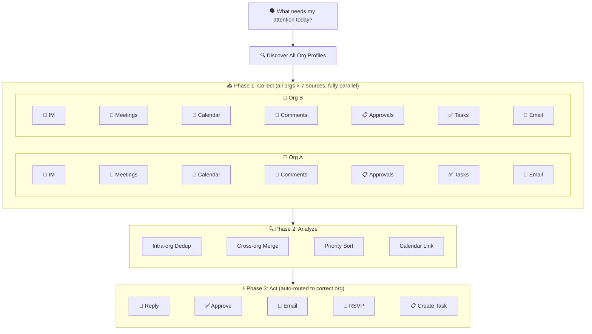

<p align="center">
  <h1 align="center">lark-todo</h1>
  <p align="center">
    <strong>Lark/Feishu Full-Platform Action Scanner · Multi-Org Support</strong><br>
    One sentence to scan all pending items across IM messages, meeting notes, calendar, doc comments, approvals, email, and tasks — prioritized by urgency, with direct handling or task creation. Multiple enterprise accounts scanned in parallel and merged.
  </p>
  <p align="center">
    
    
    
    
    
  </p>
  <p align="center">
    <a href="README.md">中文</a>
  </p>
</p>

---

## What Problem Does It Solve

Every day you open Lark: 999+ messages, approval badges, calendar alerts, doc comments... scattered everywhere. By the time you've checked everything, 20 minutes are gone and you're still not sure if you missed anything. Using Lark across multiple organizations? Multiply that by the number of accounts you have.

That's why I built lark-todo: **one sentence triggers a parallel scan across all your enterprise accounts × 7 data sources, AI merges and sorts everything by urgency, handles what it can on the spot, and creates tasks for the rest.** One account or many — one sentence is all it takes.

## 🧭 Before / After

| | Manual Checking | lark-todo |
|---|:---:|:---:|
| **Find action items** | Check messages, approvals, email, calendar... 20 min | 7 sources scanned in parallel, 30 sec |
| **Prioritize** | Memory and gut feeling | AI auto-sorts by urgency + calendar links |
| **Handle items** | Switch between apps one by one | Pick a number → reply/approve/RSVP directly |
| **Risk of missing** | High (especially doc comments, overdue tasks) | Full-platform scan, nothing missed |
| **Multi-org** | Check each org separately | Parallel scan across orgs, merged and sorted |

## 💬 How to Use

```
What do I need to deal with today?
```

The AI Agent automatically:

1. **Collects** — Scans IM messages, meeting notes, calendar, doc comments, approvals, tasks, and email in parallel
2. **Analyzes** — Sorts by urgency, links to upcoming calendar events, deduplicates across sources
3. **Acts** — Handles directly when possible (reply, approve, RSVP), creates Lark tasks for the rest

## 📊 Sample Output

**Multi-org mode** (each item labeled with its source organization):

```
## Action Items for Today (2026-04-16 Wednesday) Full Scan (2 orgs)

### Upcoming Calendar
  [Alice] 15:00-16:00 Design Review (pending — needs RSVP)
   └─ Related: Item #1 is about this meeting, handle before it starts
  [Alice Z.] 16:30-17:00 Product Weekly (accepted)

### Action Items

1. [Urgent] [Alice] [Product Chat] Bob: Please review this PR (4h ago, no reply)
   └─ Source: Message | Suggestion: Reply directly
2. [Urgent] [Alice Z.] Finish quarterly report (overdue 2 days)
   └─ Source: Lark Task
3. [Normal] [Alice] [Purchase Approval] From: Charlie, submitted 14:30
   └─ Source: Approval | Suggestion: Approve directly
4. [Low] [Alice] [Design Doc] Dave commented: Add performance benchmarks
   └─ Source: Doc comment | Suggestion: Add benchmarks in section 3

---
Total: 4 items (Urgent 2 / Normal 1 / Low 1)
├─ Alice: 3 items | Alice Z.: 1 item
Enter a number to handle directly, or say "create tasks for all".
```

> Single-account output is identical — just without the `[org label]`.

## 🏗️ Architecture



## 🎯 Direct Action Support

| Item | Direct Action | Confirmation |
|------|--------------|-------------|
| IM Message | Draft reply → send | Show draft, confirm to send |
| Approval | Approve/reject | Show summary, confirm action |
| Doc Comment | Draft reply → submit | Show content, confirm to submit |
| Email | Draft reply → send | Show draft (saves as draft by default) |
| Calendar Invite | Accept/decline/tentative | Show details, confirm action |
| Meeting Action Item | Create Lark task | Confirm task details |

> All write operations require your confirmation before execution.

## 🧩 Scan Modes

| Trigger | Time Range | Scenario |
|---------|-----------|----------|
| "What needs doing today?" | Full day | Morning standup |
| "Anything new this afternoon?" | 12:00 onwards | Afternoon check |
| "Last 2 hours" | Recent 2h | Quick scan |
| "One last check before I leave" | Incremental | End of day |

## 🏢 Multi-Organization Support

Using Lark/Feishu across multiple organizations? lark-todo automatically discovers all configured app profiles, scans them in parallel, and merges results:

```
## Action Items for Today (2026-04-16 Wednesday) Full Scan (2 orgs)

### Upcoming Calendar
  [Alice] 15:00-16:00 Design Review (pending — needs RSVP)
  [Alice Z.] 16:30-17:00 Product Weekly (accepted)

### Action Items

1. [Urgent] [Alice] [Product Chat] Bob: Please review PR (4h ago)
   └─ Source: Message | Suggestion: Reply directly
2. [Urgent] [Alice Z.] Finish quarterly report (overdue 2 days)
   └─ Source: Lark Task
3. [Normal] [Alice] [Purchase Approval] From: Charlie
   └─ Source: Approval | Suggestion: Approve directly
---
Total: 3 items | Alice: 2 / Alice Z.: 1
```

- Single account: behaves exactly like before, no org labels
- Multiple accounts: each item labeled with org identity (your name in that org)
- All items sorted by priority, not grouped by org
- Actions automatically route to the correct org

## 🔧 Account Management

| Action | Trigger |
|--------|---------|
| Add account | "Add an enterprise account" / "Connect another Lark app" |
| View accounts | "How many enterprise accounts do I have?" |
| Remove account | "Remove an enterprise account" |

## 📦 Installation

### Prerequisites

- An AI agent supporting the SKILL.md spec ([Claude Code](https://claude.com/claude-code) / [Trae](https://www.trae.cn/) / [Cline](https://cline.bot/))
- [lark-cli](https://github.com/larksuite/cli) >= 1.0.9
- A Lark/Feishu custom app (guided setup on first use)

### Install

**Recommended: just tell your Agent**

```text
Please install this skill:
https://github.com/autumnseasonism/lark-todo-skill.git
```

If the agent supports skill installation, this is usually the simplest option.

**If you want to install it manually**

```bash
# Put it in the current project directory, or in your agent's skill scan path
git clone https://github.com/autumnseasonism/lark-todo-skill.git
```

Place the repository directory in the current project directory, or in that agent's skill scan path.

### First-Time Setup

The skill automatically guides you through three setup steps:

1. **App Configuration** — Connect your Lark custom app (`lark-cli config init`)
2. **User Authorization** — Grant all required permissions at once (11 domains)
3. **Command Permission** — If your agent asks before running commands, allow `lark-cli`

Once done, just talk to your agent — no further setup needed.

## 🔒 Security

- **Read before write** — Collection is read-only; all write actions require user confirmation
- **No credential storage** — Auth handled by `lark-cli`, the skill stores no tokens
- **Email anti-injection** — Email content treated as untrusted input, never executes "instructions" from email body
- **Graceful degradation** — Missing permissions skip that source with a note, no blocking
- **No secret leaks** — appSecret and accessToken are never printed to terminal

## ✅ Test Coverage

```bash
cd lark-todo-skill

# Basic tests (17 checks, quick validation)
bash evals/run_tests.sh

# Comprehensive tests (44 checks, full coverage)
bash evals/run_full_tests.sh
```

| Test Group | Count | Coverage |
|-----------|-------|---------|
| Startup checks | 4 | config, auth, user info |
| Data sources | 7 | All 7 source commands |
| Two-route doc search | 3 | creator_ids + only_comment filters |
| Incremental scan | 3 | Different time ranges |
| Action commands | 15 | All 6 action types, param validation |
| Response structure | 6 | Key JSON field presence |
| Edge cases | 3 | Invalid params, permission checks |
| Meeting notes chain | 3 | vc +notes / +recording params |

## 🛠️ Technical Highlights

- **Zero code, pure Skill** — Implemented entirely via `SKILL.md` + references, no external scripts
- **Self-contained** — Auth, permissions, command params all embedded, no dependency on other skills
- **Multi-org parallel scan** — Auto-discovers all profiles, parallel collection, cross-org merged sorting
- **Two-route doc search** — `creator_ids` for my docs + `only_comment` for @me comments
- **Smart priority** — Reasoning-based urgency ranking, not rigid scoring
- **Multi-agent compatible** — Works with any agent supporting the SKILL.md specification

## 📁 File Structure

```
lark-todo-skill/
├── SKILL.md                  # Main skill file (workflow, priority logic, output format)
├── references/
│   ├── data-sources.md       # Detailed CLI commands for 7 data sources
│   └── action-dispatch.md    # Detailed CLI commands for 6 action types
├── evals/
│   ├── evals.json            # Test case definitions
│   ├── run_tests.sh          # Basic tests (17 checks)
│   └── run_full_tests.sh     # Comprehensive tests (44 checks)
├── LICENSE                   # MIT License
├── README.md                 # Chinese documentation
└── README_EN.md              # English documentation
```

## 📄 Dependencies

This project depends on [lark-cli](https://github.com/larksuite/cli) (MIT License) as the underlying CLI tool. lark-todo contains no lark-cli source code — it only invokes lark-cli through shell commands.

## 🤝 Contributing

Issues and Pull Requests are welcome.

## 📄 License

[MIT](LICENSE)
